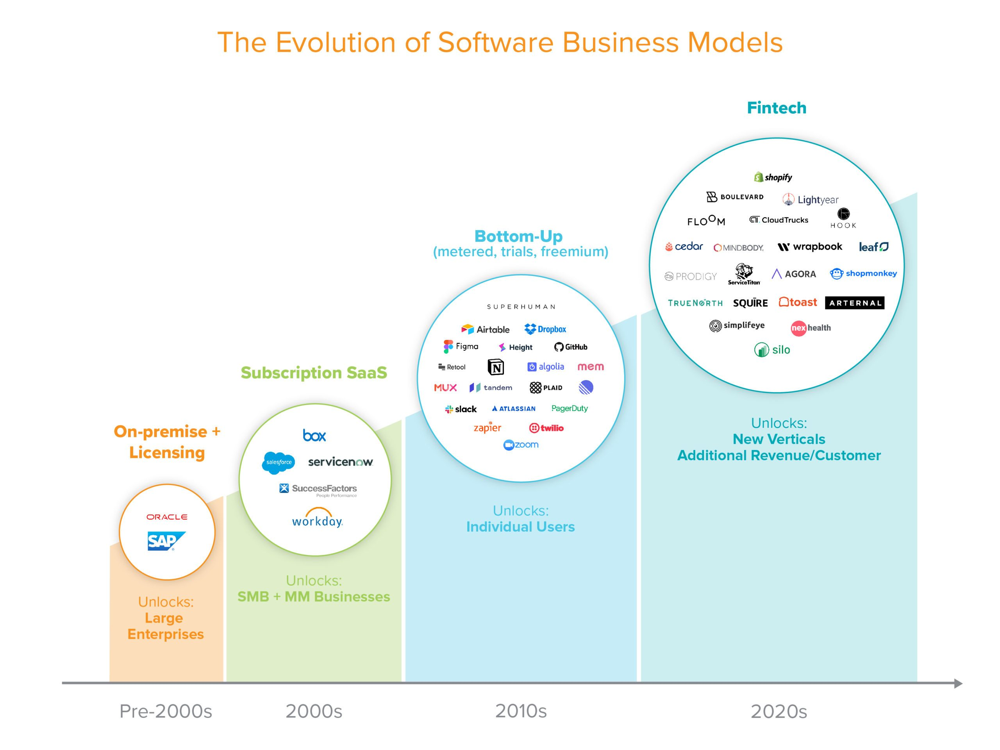
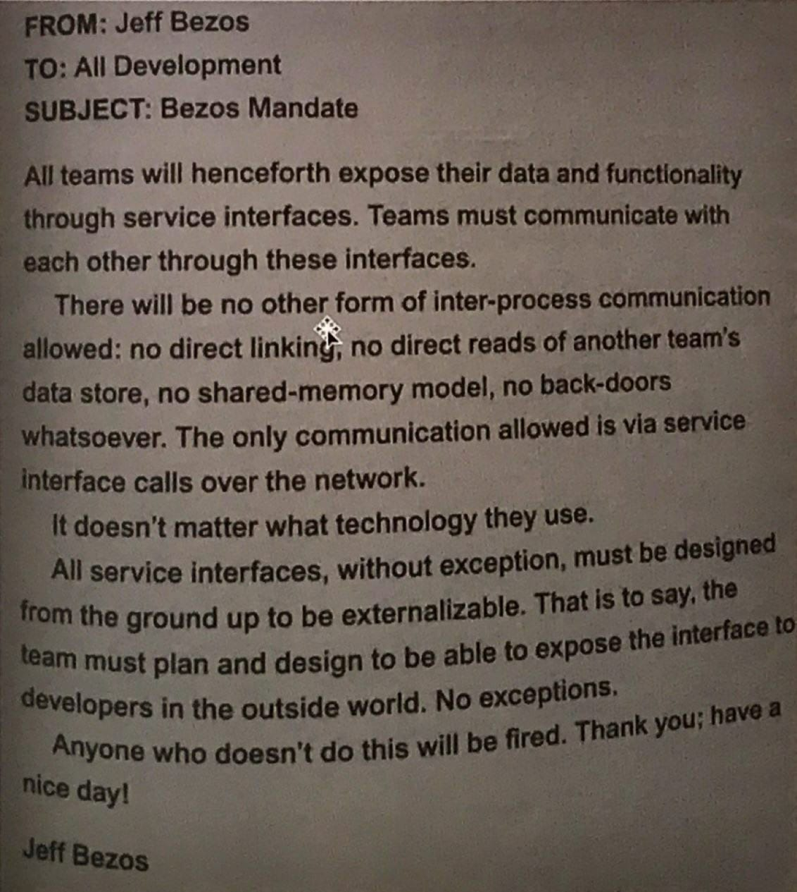

In this post I wanted to better understand and learn about the potential of something that is now called embedded financial services - embedded fintech. I will try to explain its importance for any business model as well as try to articulate what needs to be done so that any business can eventually tap into, what I personally believe, this growing opportunity. 

Let's dive in!

# Everything started with the SaaS revolution

Around the 1960s computers were gigantic and very expensive. Very few SMB could actually afford a computer that was performant enough, and in a way, what is now called "cloud computing" or "SaaS" (Software as a Service) was born. Back then it was called "time sharing system" and, according to literature, it enable companies to have access to computing power. 

Fast forward to today and we have a big penetration of SaaS models across different verticals and industries with the most common type of SaaS being the CRM. CRMs probably started around 2001 or so and back then this business had to tackle a couple of different problems to succeed. Data privacy was a big issue, however because the data being uploaded to the "time sharing system" didn't involve financial information it was able to pass the risk aversion scrutiny of CFOs and CEOs. 

Quietly SaaS models moved up the value chain and are now ingesting all sorts of confidential data - from HR, Accounting and Logistics, you name it...pick up a vertical, there is a SaaS model that will fit your needs and help you manage your business.  

But how did this happen?

The guys at a16z have put together a fantastic post that goes by the name of [Fintech Scales Vertical SaaS](https://a16z.com/2020/08/04/fintech-scales-vertical-saas/) that explains the evolution of software business models and splits their journey into 4 distinct buckets:
- On-Premise + Licensing
- Subscription SaaS
- Buttom-Up 
- Fintech

The last segment, Fintech, is very interesting and is now being built as a service to enable vertical integrated industries to serve their customers with financial services - Shopify, where financial services are now about 50% of their revenue, is a great example of the fintech creeping in to SaaS modes with vertical integration potential.

The different SaaS models behave like lego blocks and once they are fitted together they can created the modern infrastructure of state of the art startups. You can easily see this in the example of Uber that, at a very high level, is taping into **(a)** google maps for maps services, **(b)** twillio to improve the communications with users and **(c)** braintree to facilitate payments. 

a16Z post talks about the importance of embedding fintech vs just reselling it. For me the most common resellers of fintech are the comparison websites where the value they provide to customers is by giving them options and putting those side by side. However, once the user is clear on what he / she wants, they get re-routed to the company website of that given product. For the user this is fantastic, however it will not be as contextual as an embedded proposition not to mention the value generated by the transactional data will not be kept by the company providing the service in the first place. It will be hard for the comparison website to fully understand if the user converted or not.

# Interoperability of software is creating a lot of value

We have establish that interoperability of systems is very important to generate value, what we didn't mentioned is for that to happen is critical to have and leverage programmatic interfaces, a.k.a. APIs.

Last year I put together a post were I try to explain [the importance of APIs](/blog/2019-11-26-apis-are-the-new-railroad/) by comparing them with the importance of the rail road back in the day. The rail road infrastructure was very important back them and propelled the Industrial revolution. Today APIs propelled the SaaS revolution, just look at this email that Jeff Bezos sent back in 2001 to Amazon's employees. 

Very harsh... but I guess it did the thing.

For developers APIs can be a blessing as they can now solve for real problems affecting their customers and limiting the hassles of procurement, integration, management, and operations. While this was and exception to the rule at the beginning, I believe that this becoming more prevalent.

For companies in a fast pace and ever changing environment, APIs are no longer a stop-gap to the future—they’re a critical part of their strategy. Why recreating something in-house that’s done so much better elsewhere? You can now totally focus on your own product a customer experience. 

Organizations exposing complex services as simplified code, API-first products are going to pave the way for the next generation of value creation in the SaaS world.

# Embedded fintech the value creator

From a customer standpoint having to manage multiple SaaS providers is not great, specially if the scope is related in a way, or if data sharing could seriously help with the value that customers are getting. For example, any company using accounting platforms, such as Xero or Quickbooks, could simple share their financial details and quickly get a loan approved if needed. Why would they want to manage separate accounts and have to learn to navigate different products?

This challenge is a great opportunity for any SaaS company that is providing the core service for a given customer. Accounting platforms are a great example of a vertical building on top of this particular challenge - they created a marketplace of different SaaS models that their users can tap into. Shopify, as previously mentioned is also another good example. 

This vertical integration will impact LTV figures, potentially reducing churn and increasing customers value. According to a16Z: 

> Fintech "increases revenue per user by 2 to 5x versus a standalone software subscription"

This is now possible because a lot of companies are not building very complex products and services as a simplified API end-point. SaaS models with clear vertical potential are ripping the benefits of this new wave of API first companies.

But business don't necessarily need to be SaaS model, as long as they have a digital proposition it will be possible to tap into this new value creation. 

Companies like [lendflow.ai](https://lendflow.io/) enable anyone to provide lending to their users without needing to run a lending operation. By simply integrating lendflow in context with the user journey any company can now provide lending to their customers, not only creating a new revenue stream but also making sure to convert the user. 

# The current need

Liquidity is now, given the current pandemic, more important than ever. SMBs are struggling and need capital. Incumbent banks take ages to approve credit, perform KYC and AML procedures, and once all the paper work is finalized the likelihood of getting credit approved is thin.

Fintechs can probably solve that challenge given that they will be able to create that complex process into a simple piece of code. However, they might also have to work with financial institutions to provide them liquidity so that, in turn they can help SMBs in distress or that simply need to borrow money but would like to do so in the comfort of their leaving room.

